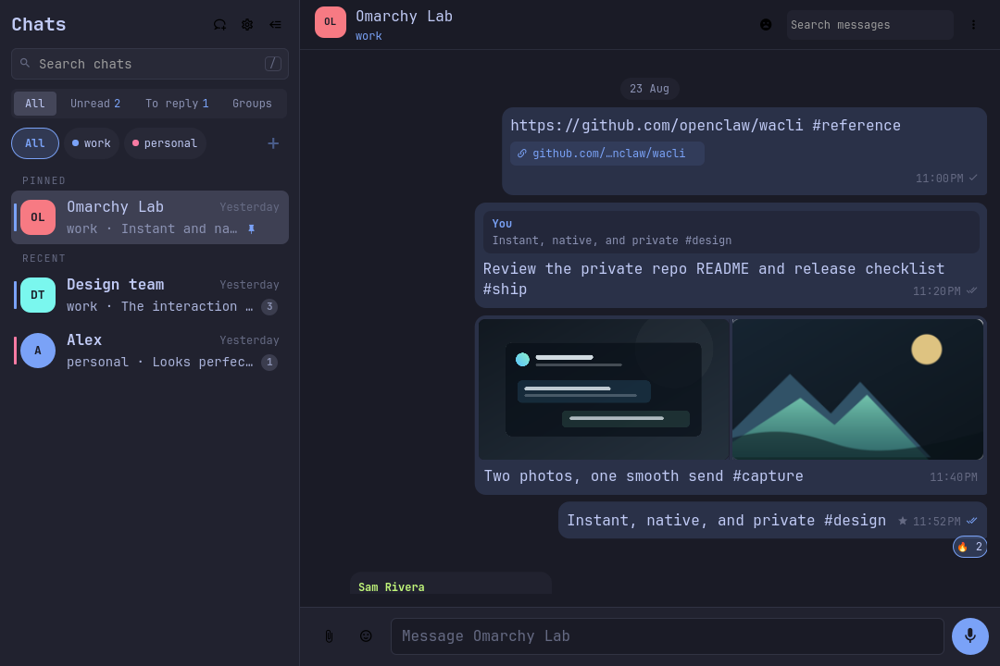
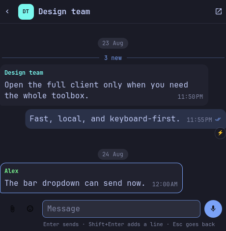
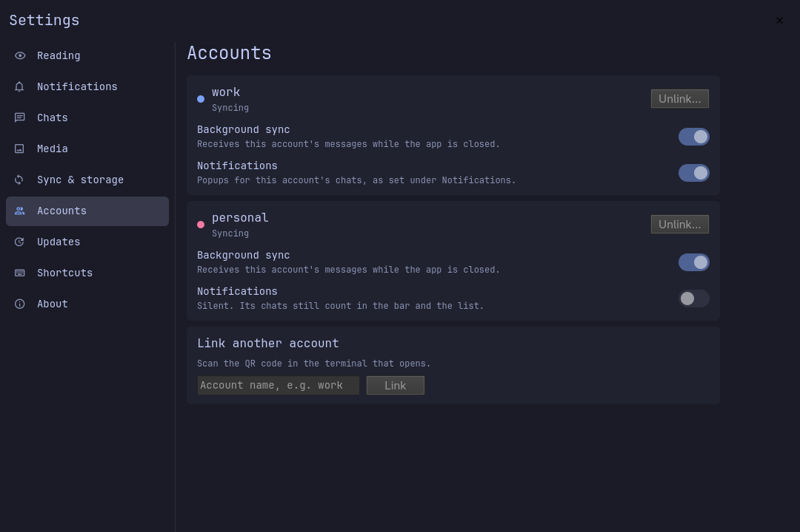

<h1 align="center">WhatsApp for Omarchy</h1>

<p align="center"><strong>WhatsApp, native to the Omarchy shell. Not a browser tab.</strong></p>

<p align="center">
  <a href="LICENSE"></a>
  
  
</p>


A fast, local-first WhatsApp client for [Omarchy](https://omarchy.org). Your
chats live in a private local mirror kept by
[`wacli`](https://github.com/openclaw/wacli); the app renders it in Quickshell,
follows your Omarchy theme, and lives in your bar. No Electron, no browser
wrapper, and no server of its own: messages go only to WhatsApp.

## Why it feels different

**Opens instantly, works offline.** Chats and messages come from a local
SQLite mirror, so the window never waits for the network. New messages appear
the moment sync writes them, without polling. Pause sync and the whole archive
stays readable and searchable.

**Reply from the bar.** Click the bar icon for a compact client: recent chats,
the conversation, and a real composer with files, emoji and voice notes. Most
replies never need the full window.

**Everything a chat needs.** Replies, edits, reactions, polls, stickers,
albums, up to 10 files with a caption, real `@` mentions, voice notes you
review before sending, forwarding to several chats at once with a note, and
deleting many messages together.

**Feels like the phone.** The chat on screen is read, replying marks it read,
and the contact sees you typing. Desktop notifications carry the chat photo,
open the chat on click and can be answered from the bar. Muted and archived
chats stay quiet.

**Several accounts, one list.** Link more than one number: the chat list
merges them, each account has its own color, and each can pause its sync or
silence its notifications on its own.

**Native to Omarchy.** Theme colors and fonts, keyboard-first everywhere, and
real layouts from a wide window down to 360 px. Quit with `Ctrl+Q`, and choose
whether it starts with the system.

**Private by design.** No account, server or telemetry of its own. Reading a
chat never sends a read receipt. Screenshots and tests use synthetic demo data
only. See [privacy](docs/PRIVACY.md).

**Ready for your agent.** An agent skill and an MCP server with 46 tools let
Claude Code and other agents read and act on WhatsApp for you, asking before
anything that changes WhatsApp.

## A closer look

| The full app | From the bar |
|---|---|
|  |  |

| Real group mentions | Native media viewer |
|---|---|
|  |  |

| One card per account | Down to 360 px |
|---|---|
|  |  |

Every screenshot is rendered from the repository's demo data. No real
conversation is included in this repository.

## Install

```bash
omarchy pkg aur add wacli-bin
omarchy plugin add https://github.com/atoslins/Omarchy-WhatsApp-v2 --enable
```

That is all on the command line. The first time the app opens it walks you
through the rest:

1. **Set it up on this computer.** One click adds, in your home folder only,
   the background sync (a sandboxed user service), the `omawhatsapp` command,
   and, if you allow it, the agent skill and the MCP server. No sudo or pkexec is required.
2. **Link your phone.** Show QR code opens the code in a terminal; scan it
   from WhatsApp → Linked devices on the phone.

**Requirements.** Omarchy 4 (Quattro) and
[wacli](https://github.com/openclaw/wacli) 0.17.1 or newer (tested with
0.17.1, 0.18.3 and 0.19.0). The AUR `wacli-bin` package installs the official
release, byte for byte the one the tests run against; a wacli of your own at
`~/.local/bin/wacli` is used first. Choosing files to attach needs `zenity`,
which the app offers to install the first time it is missing. Everything else
comes with Omarchy.

**Add the shortcut.** Copy the `Super+Shift+W` line from
[`omarchy/bindings.lua.example`](omarchy/bindings.lua.example) into
`~/.config/hypr/bindings.lua`.

**Coming from OmaWhatsApp?** Add this app; its setup offers to turn
OmaWhatsApp off (it is not deleted, and only one of the two can run) and keeps
the same linked device and history, so nothing is linked again.

## Update and remove

**Update.** Settings → Updates checks the repository and runs
`omarchy plugin update` in a terminal, which shows the changes and asks
first; the shell then restarts to load them. From a terminal:

```bash
omarchy plugin update io.github.atoslins.whatsapp && omarchy restart shell
```

**Remove.** Settings → Sync & storage → **Remove from this computer** stops
background sync and removes what the setup added; then **Remove the app too**
runs `omarchy plugin remove io.github.atoslins.whatsapp`. Your linked device
and wacli's message store stay, so adding the app again picks up where you
left off.

## wacli: official and richer builds

Everything above works with official wacli releases. A few extras need wacli
additions that are not in an official release yet. The app detects them and
turns each one on by itself:

| Feature | Official wacli | With the additions |
|---|---|---|
| Chats, sending, media, groups, notifications, several accounts | ✓ | ✓ |
| Showing the contact that you are typing | ✓ | ✓ |
| Ticks for sent, delivered and read | no tick shown | ✓ |
| A contact's online, last seen and typing | not shown | ✓ |
| Starring messages | hidden | ✓ |
| `@` on chats whose unread messages mention you | not shown | ✓ |
| Forwarding and deleting without pausing sync | pauses sync for a few seconds | ✓ |

## Let your agent use WhatsApp

When you allow it during the setup (or later in Settings), the app links an
agent skill at `~/.agents/skills/omawhatsapp`, so compatible agents can use
`$omawhatsapp` to search, summarize and, when you ask, act on your chats. For
Claude Code and other MCP clients, register the server once:

```bash
claude mcp add --scope user whatsapp -- ~/.local/bin/omawhatsapp-mcp
```

Then ask in plain words: "who wrote to me that I have not read yet, and about
what", "what attachments did Bruno send this month", "reply to Carlos that I
am on my way", "tag these five as suppliers and tell each of them we are
closed tomorrow".

Both are fail-closed. Each of wacli's 104 operations is classified as a local
read, remote read, local write, sync, WhatsApp write, destructive or
interactive action; local reads run read-only, and everything else needs your
request. Tools that change WhatsApp are marked so the client asks you first
and shows the recipient and the text. Neither ever writes to WhatsApp's
database directly, invents a recipient or retries a send that may have gone
through. Details in the
[agent gateway reference](skills/omawhatsapp/references/wacli-parity.md).

## Documentation

| Page | For |
|---|---|
| [Using the app](docs/USAGE.md) | Every feature, the settings and all keyboard shortcuts |
| [Privacy](docs/PRIVACY.md) | What is stored, where, and what never leaves your machine |
| [Architecture](docs/ARCHITECTURE.md) | How the service, the window, the helper and wacli fit together |
| [Technical notes](docs/TECHNICAL.md) | Performance budgets, refresh and sync details |
| [WhatsApp parity](docs/PARITY.md) | Which WhatsApp features exist and how each one was verified |
| [Agent gateway](skills/omawhatsapp/references/wacli-parity.md) | How each of wacli's operations is classified and guarded |
| [Testing](docs/TESTING.md) | The release gate and the screenshot rules |
| [Changelog](CHANGELOG.md) | What changed in each release |

## Quality

```bash
./scripts/test
```

The release gate runs 325 helper, setup and agent tests, 557 offscreen QML
tests in 60 suites, a simulated `omarchy plugin add` into an empty home,
manifest validation, QML lint and shell checks. CI runs it against wacli
0.17.1, 0.18.3 and 0.19.0.

## Credits

WhatsApp for Omarchy began as a fork of
[OmaWhatsApp](https://github.com/MoizIbnYousaf/Omarchy-Whatsapp) by
MoizIbnYousaf, which built the resident service, the bar dropdown, the helper
boundary and much of the interface this app stands on. Its model was informed by
[Omamail](https://github.com/huacnlee/omamail), and WhatsApp itself is reached
through [wacli](https://github.com/openclaw/wacli). See the
[third-party notices](THIRD_PARTY_NOTICES.md).

WhatsApp for Omarchy is independent and not affiliated with WhatsApp or Meta.

## License

[MIT](LICENSE) © 2026 MoizIbnYousaf (the original OmaWhatsApp) and Atos Lins.
