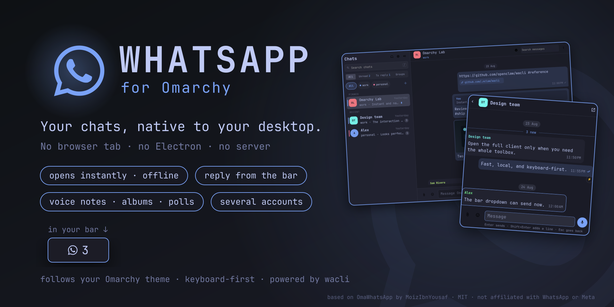
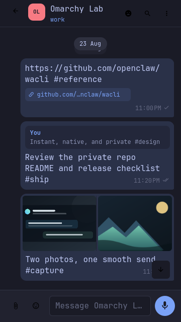
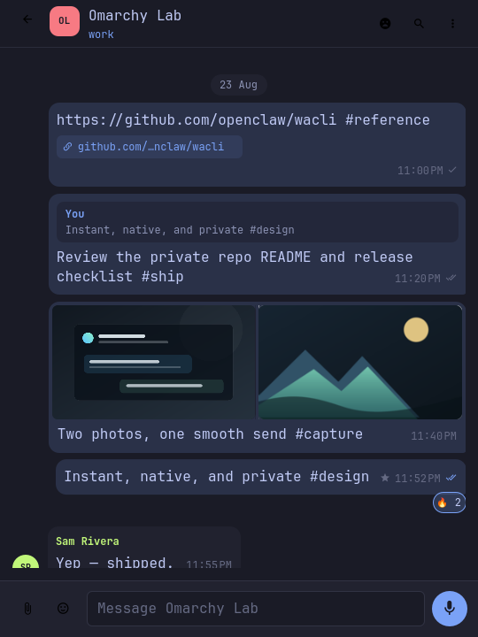
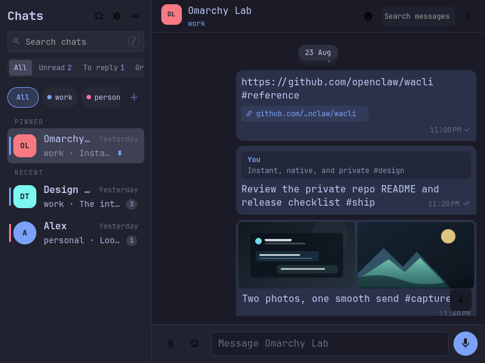
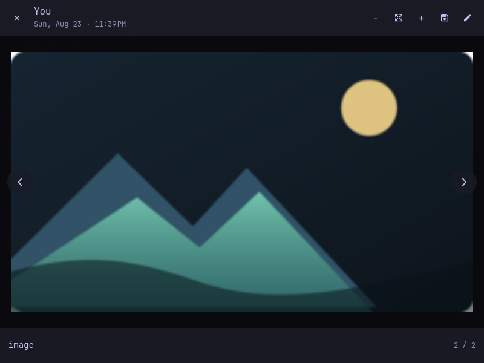
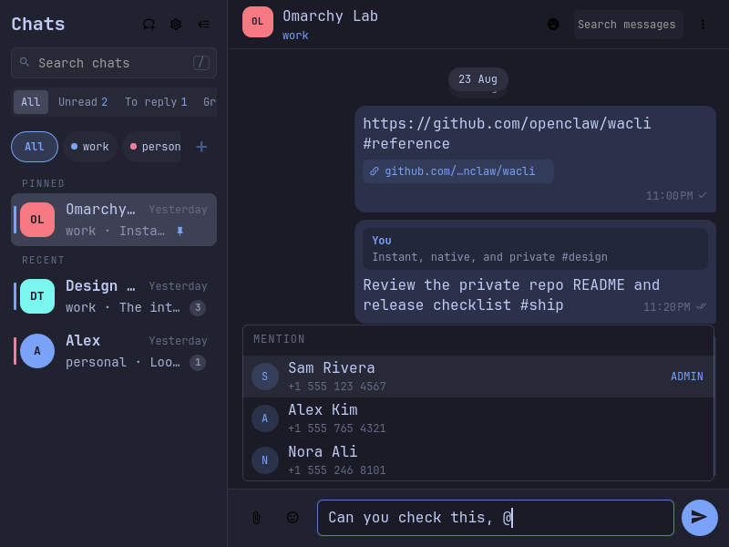

# OmaWhatsApp

**WhatsApp in Quickshell—not Chromium.**

> Omarchy-WhatsApp-v2 is a fork of
> [MoizIbnYousaf/Omarchy-Whatsapp](https://github.com/MoizIbnYousaf/Omarchy-Whatsapp)
> that follows current wacli releases and reworks the interface.

OmaWhatsApp is a fast, local-first WhatsApp client made for Omarchy. It renders
the private mirror maintained by [`wacli`](https://github.com/openclaw/wacli),
opens without waiting on the network, and follows the active Omarchy theme. No
Electron runtime, browser wrapper, or cloud backend is added.

## Why this exists

WhatsApp Web can feel slow and janky on the desktop, and it does not follow
Omarchy themes. OmaWhatsApp exists to make everyday chats feel immediate,
native, and visually at home in Omarchy.



## A WhatsApp client that feels like Omarchy

- **Local-first opening.** Chats and messages render from SQLite immediately;
  network sync continues in a quiet user service.
- **Change-driven refresh.** A tiny resident filesystem watcher debounces
  SQLite/WAL changes, so new messages appear immediately without hot polling.
- **A real offline switch.** Pause and disable background sync in settings;
  the complete local archive remains searchable and readable.
- **Reading works like the phone.** The conversation on screen is marked
  read, including messages that arrive while it is open, and replying marks a
  chat read too. wacli only syncs that state to your own devices, so contacts
  never get a read receipt from OmaWhatsApp. Settings can turn automatic
  reading off, and the chat list marks any chat read or unread.
- **Ticks for what you send.** Sent, delivered, and read show on your
  messages and in the chat list, as on the phone. They need a wacli build that
  keeps receipts; with official wacli, and for messages synced before it, no
  tick is shown rather than a guessed one.
- **One native plugin.** The service, full app, and configurable recent-chat
  dropdown share a single Omarchy plugin lifecycle.
- **No duplicate sync process.** Sends use wacli's live companion path and a
  serialized fallback only when its store is locked.
- **Responsive by design.** Wide, compact, narrow, and 360 px layouts are real
  layouts—not a clipped desktop view.
- **Theme-native.** Colors, typography, spacing, hover states, and focus come
  from the active Omarchy theme.
- **Keyboard-native.** Jump between chats, collapse the rail, search, attach,
  reply, and open media without leaving the keyboard.
- **Draft-first voice notes.** Record native OGG/Opus audio, stop into a local
  preview, then explicitly send or discard it—never auto-send on stop.
- **Agent-native.** The installer ships a shared `$omawhatsapp` skill with
  complete guarded wacli parity: ordinary chat work uses the app's exact-target
  helpers, while all 104 advanced wacli 0.19.0 operations pass through a
  classified, bounded JSON gateway.

## Everyday conversation flow

- Browse every locally synced direct message and group; search chats or the
  current conversation, and switch the list between All, Unread, Groups and
  Archived.
- Start a new chat with `Ctrl+N` or the button beside "Chats": search the
  people you know by name or number, or type a number with its country code.
  WhatsApp confirms the number before the first message can be written.
- Send multiline text, replies, edits, reactions, interactive options, polls,
  stickers, and up to 10 files with a caption.
- Press `Ctrl+Shift+V` to start or stop a voice note from either client. The
  microphone is released before a review card appears with playback, elapsed
  time, discard, and one explicit send action.
- Type `@` in a group for a filtered member picker; OmaWhatsApp sends a real
  WhatsApp mention rather than decorative text.
- Paste text, screenshots, GIFs, or local files; drag files into the window;
  review and remove attachments before sending.
- A multi-photo selection stays one action and renders as a responsive album;
  its real WhatsApp media-message IDs remain intact underneath.
- Render images, stickers, animated GIFs, WhatsApp's looping-video GIFs,
  videos, voice/audio messages, documents, locations, quotes, reactions,
  edited/forwarded/starred state, and button rows.
- Download a missing video into its native inline player with one click; locally
  available videos show a real decoded preview rather than a blank panel.
- Filter the merged chat rail by account with one click, link another account
  in a guarded terminal flow, and explicitly refresh privately cached profile
  photos without making ordinary chat browsing network-dependent.
- Open photos, GIFs, and videos in a full-window native gallery with fit/zoom,
  previous/next navigation, playback, metadata, and external-open controls.
- When [`Omasnap`](https://github.com/tobi/omasnap) is installed, Open
  externally sends images straight into its native annotation editor; other
  media and systems fall back to the desktop's default viewer.
- Drag across message text to copy it automatically, or use Copy from the
  message menu; a small confirmation toast appears. Reply, edit, forward,
  delete for you, and delete for everyone share the same action surface.
- Keep a separate draft, reply/edit context, and pending attachment queue for
  every chat while switching between conversations.
- Get a desktop notification for each chat with new messages: the chat photo,
  the sender and text (or just the chat name), one short sound unless
  Omarchy's do not disturb is on, and a click that opens the chat. Muted and
  archived chats stay silent, and so does the chat you are reading.
- Get a quiet bar badge that counts unread chats, not messages; its tooltip
  gives both. Opening a chat acknowledges that chat locally; middle-clicking
  the bar dismisses the current batch. New incoming messages light it up again, while muted and archived
  chats remain readable without raising the bar badge.
- Click the bar badge for a compact, anchored mini client with local search,
  unread state, recent messages, replies/reactions, clipboard attachments, a
  real composer, and J/K navigation. `O` expands the exact conversation into
  the full client; `Super+Shift+W` remains the direct full-app shortcut.
- Open the settings to choose whether open chats and replies mark chats read,
  pause background sync, show/hide the local bar badge, and choose a
  5/7/9-chat dropdown—all persisted privately on this device.
- Choose System, 12-hour, or 24-hour timestamps in settings. System follows
  your locale by default; one saved preference covers chat previews, message
  bubbles, and the media viewer for every account.

The graphical client shows people and every group you chat in, groups inside
a Community included, as the phone's chat list does. Channels/newsletters,
calls, and the Community itself stay out of the visual rail until they receive
deliberate top-level interfaces. The bundled agent skill can still inspect and
operate those wacli capabilities when the current request explicitly asks.

Missing media is downloaded only after you ask for it. The helper verifies the
chat and message against the local mirror before any wacli write crosses the
boundary.

## Let your Omarchy agent use WhatsApp

Installation also places the repository-owned skill at
`~/.agents/skills/omawhatsapp`. Compatible agents can use `$omawhatsapp` to
search or summarize local chats and, when you explicitly ask, use every
capability exposed by wacli 0.19.0: messaging, media, calls, channels,
contacts, group administration, history, polls, presence, profiles, accounts,
sync, exports, and maintenance.

The skill is local-first and fail-closed. Every command is classified as a
local read, remote read, local write, sync, WhatsApp write, destructive, or
interactive operation. Local reads force wacli's read-only mode; every other
class requires authorization from the current request. It never invents
recipients, writes WhatsApp databases directly, treats opening a chat as a
receipt, turns offline mode off by itself, creates test messages, or retries a
possibly delivered mutation. Unknown future wacli commands remain blocked
until they are classified.

### Claude Code and other MCP clients

Installation also places `~/.local/bin/omawhatsapp-mcp`, a Model Context
Protocol server that turns the helper into named tools an agent calls
directly. Register it once:

```bash
claude mcp add --scope user whatsapp -- ~/.local/bin/omawhatsapp-mcp
```

Then ask in plain words: "who wrote to me and I have not read yet, and what
about", "search my chat with Ana for when she recommended a movie", "what
attachments did Bruno send this month", "reply to Carlos that I am on my way",
"create a group with Ana, Bruno and Carlos called Obra", "tag these five as
suppliers and tell each of them we are closed tomorrow".

The 46 tools cover reading (status, chats and views, unread messages with
context, chats awaiting your reply, reading a chat by period, full-text search
with filters, message context, starred messages, attachments across chats,
opening an attachment, contacts and tags, chat and group details, call
history, polls and their votes, status updates from your contacts, a contact's
about and business profile, followed channels) and acting (sending, replying,
reacting, forwarding, editing, deleting, files, first messages to a number,
polls and votes, locations, chat states, group creation and administration,
contact aliases and tags, one private message to each of several people,
profile, posting and deleting your status, channels, invite links, exports,
older history from the phone, and missing attachments). Older history is a
two-step routine: the agent first asks you to open WhatsApp on the phone, and
only then asks the phone.

Every tool that changes WhatsApp is annotated as such, so Claude Code asks
before each call and shows the recipient and the text. The server never opens
the WhatsApp store itself: it calls the helper, which applies the same
boundaries and authorization classes as the skill. Group creation, contact
tags and aliases, profile and status changes, channel lookups, and older
history pause background sync for a few seconds (older history for up to about
a minute); a message arriving then reaches the local archive once wacli
catches up, and the phone has it throughout. wacli does not keep channel
posts, so channels can be listed, joined, and left but not read. A WhatsApp
Business number refuses changes to its about text, and on the account tested
WhatsApp refused to create communities through wacli.

## One app at every size

| 360 × 640 | 540 × 720 |
|---|---|
| Single-pane mobile flow | Focused narrow conversation |
|  |  |

| 800 × 600 | Native media viewer |
|---|---|
| Compact two-pane layout | Photos, GIFs, and video without leaving the app |
|  |  |

### Real group mentions



All screenshots use repository-owned demo data. No real conversation is
included in this repository.

## Architecture

```text
bar item ──► anchored mini client ──► messages + composer
                       │
Super+Shift+W ─────────┴──► full QML window ◄────── resident QML service
          │                   │        │
          │                   │        └── debounced SQLite/WAL watcher
          ├── read-only SQLite ◄── wacli sync --follow ◄── WhatsApp
          └── bounded helper ─────► live companion / wacli CLI
```

The window performs no network request when it opens. The bar does not start a
poller, and closing either surface does not throw away the warm chat rail. See
[technical notes](docs/TECHNICAL.md) and the [parity contract](docs/PARITY.md).

## Add it to Omarchy

### Install once

Paste this into your agent, then let it handle the rest:

```text
Install OmaWhatsApp for me.

OmaWhatsApp is a native, local-first WhatsApp client for Omarchy. Read
https://github.com/atoslins/Omarchy-WhatsApp-v2 and install it for this
machine using the repository's installer. If you cannot run local commands in
this chat, tell me to use Codex, Claude Code, OpenClaw, or another agent that
can.

Keep all WhatsApp data private. Never put chats, contacts, message IDs, media
paths, session files, QR codes, or credentials in logs, commits, issues, or
screenshots. Never write directly to WhatsApp's database or send a test
message. Ask me to complete interactive WhatsApp authentication when required.

Run the read-only preflight first, install the complete compatible set, and
verify the helper, background sync service, and Quickshell plugin end to end.
Use only the repository's synthetic/demo data for tests or screenshots. Then
tell me what was installed, whether every check passed, and how to open it.
```

Requirements:

- Omarchy with the plugin-capable Quickshell shell
- `wacli` 0.17.1 or newer at `~/.local/bin/wacli` (verified with 0.18.3 and 0.19.0;
  commands added by a newer release stay blocked until classified)
- Qt Multimedia and Image Formats, `wl-clipboard`, `zenity`, `inotify-tools`,
  `jq`, Python 3, and systemd user services
- Optional: `libnotify` (`notify-send`) for desktop popups

```bash
git clone https://github.com/atoslins/Omarchy-WhatsApp-v2.git && \
  cd Omarchy-WhatsApp-v2 && ./scripts/install
```

### Upgrading

Open **Settings → Check for updates** to look for a stable GitHub release.
Optionally enable **Check for updates when opening the app** (off by default).
Checks send no WhatsApp data, do not run in demo/offline mode, and never install
anything automatically.

For standalone installations made with 0.12.0 or newer, **Update in terminal…**
shows the exact release and commit and asks you to type `INSTALL`. Finish voice
recording and save drafts first: the full installer restarts the Omarchy shell.
It updates the helper, plugin, skill, and services together, retaining the
existing crash-recovery behavior. This installs upstream release code; it does
not claim that the release has marketplace verification.

**Coming from an older version?** Run the full installer once to enable this
upgrade flow. Managed copies must continue using their plugin manager; the app
will not overwrite them. A failed check means “could not check,” not “up to date.”

After pulling a newer release, always re-run `./scripts/install`. Do not copy
only the plugin directory: the installer stages the QML, the
`~/.local/bin/omawhatsapp` helper, the agent skill, and the user-service
templates as one compatible set. This is especially important when upgrading
to 0.11.0: it adds a helper module used by the private profile-photo cache.
The installer resumes or rolls back an interrupted
upgrade before applying the new version.

Link this machine once when needed:

```bash
~/.local/bin/omawhatsapp wacli --interactive --authorize interactive -- auth
```

### More than one WhatsApp account

wacli owns the account list, and OmaWhatsApp follows it. Click `+` beside the
account filters, choose a name, and complete the QR flow in the terminal that
opens. When upgrading a machine with one unnamed session, OmaWhatsApp keeps
that existing store untouched and exposes it as `primary`—no session, history,
or upstream configuration is moved. That identity stays `primary` across the
first link, so an already-open draft or receipt cannot retarget to the newly
created default account.

The equivalent manual flow remains available for administration:

```bash
~/.local/bin/omawhatsapp link-account work --authorize interactive
```

The chat rail merges every account and offers `All` plus one filter per
account; filtering never changes a chat's destination. Sending, receipts,
offline mode, and the badge stay inside the account of the chat you are
looking at.

Run `./scripts/install --check` for a read-only installation preflight. A real
install validates and stages the complete plugin tree before replacing it,
installs the shared agent skill, restarts Quickshell once, and enables hardened
background sync. It never copies a WhatsApp session into the repository.

Add the `Super+Shift+W` binding from
[`omarchy/bindings.lua.example`](omarchy/bindings.lua.example).

## Controls

| Input | Action |
|---|---|
| `Super+Shift+W` | Open or close OmaWhatsApp |
| Bar item click | Open the anchored recent-chat dropdown |
| Dropdown `J`/Down · `K`/Up | Move visibly down/up through chats or mini-conversation messages |
| Dropdown `/` | Search recent chats |
| Dropdown `Enter` | Open the selected mini conversation and focus its composer |
| Dropdown `Enter` / `Shift+Enter` | Send / add a line |
| Dropdown paperclip / `Ctrl+O` | Choose and stage up to 10 local files |
| Dropdown `Ctrl+V` | Stage clipboard text, screenshots, GIFs, or files |
| Dropdown emoji button | Insert an emoji at the cursor |
| Dropdown new chat button | Open the full app's new chat dialog |
| Dropdown `Ctrl+Shift+V` | Start/stop a voice note; stopping opens review and does not send |
| Dropdown `Esc` | Composer → messages → recent chats → close |
| Dropdown `O` | Expand the exact chat into the full app |
| `Ctrl+F` | Find in the current conversation |
| `Ctrl+N` | Start a new chat (also the rail's new chat button) |
| `Ctrl+K` | Go to a chat by typing part of its name |
| Conversation photo or name | Open the chat details panel; `Esc` closes it |
| Group details → participant menu | Message, make or dismiss admin, remove (admins) |
| Group details → Load group settings | Rename, description, who may send or edit, invite link, requests, add, leave |
| Media button in the conversation header | Media, links and docs of the chat; `Esc` goes back |
| `Page Up` / `Page Down` | Scroll the conversation a screen, even while typing |
| `Home` / `End` | Oldest loaded message / newest message |
| Emoji button → Stickers | Send a recent sticker |
| Chat list edge | Drag to resize the list; double-click for the automatic width |
| `Ctrl+B` | Hide or show the chat list without losing context (also the rail's hide button, and the show button in the conversation while it is hidden) |
| Chat list `/` | Focus chat search; `Esc` returns to list navigation |
| `C` | Focus the composer |
| `Enter` / `Shift+Enter` | Send / add a line |
| `@`, then arrows + `Enter` | Find and mention a group member |
| `Ctrl+V` | Stage clipboard text, image, GIF, or local file |
| `Ctrl+O` | Add documents |
| `Ctrl+Shift+O` | Add photos and videos |
| `Ctrl+Shift+V` | Start/stop a voice note; preview, discard, or explicitly send |
| `J`/Down · `K`/Up | Move visibly down/up through messages or the focused chat list |
| `R`/`r` | Reply to the keyboard-selected message and focus the composer |
| `Enter` | Open the selected chat and focus its composer immediately |
| `C` | Focus the message composer |
| `Space` | Open selected media; play/pause inside the viewer |
| `Left` / `Right` | Previous/next gallery item |
| `+` / `-` / `0` | Zoom in/out/fit |
| `Esc` | Step back: composer → messages → chat list → close |
| Conversation subtitle | The account the open chat and composer belong to, shown only when more than one account is linked |
| Rail status line | Appears only while sync is offline or reconnecting; click it to resume a paused sync |
| Rail settings button | Automatic reading, badge, desktop notifications, background sync, dropdown size, composer expansion, chat photos, and updates |
| Chat list hover button · chat menu `Mark as unread` | Mark a chat read or unread on your devices |

Click the notification count in the dropdown header to clear every local badge
after a confirmation. Middle-clicking the bar item does the same immediately.
None of these actions marks messages read. Right-clicking the bar item mutes
every desktop notification and its sound, and shows a crossed bell beside the
count until you right-click again; it is the same switch as Settings →
Notifications. Settings
control automatic reading, the badge,
background sync, dropdown size, and the composer expansion limit.

Desktop popups are a separate surface from the bar badge and are on by
default. They need `notify-send` from libnotify, stay quiet for muted and
archived chats, and never send a read receipt. Unmuting starts from the
current messages, so nothing that arrived while muted pops up afterwards.

### Dropdown IPC

Hot corners and keybindings can toggle the bar dropdown with:

```bash
omarchy-shell io.github.moizibnyousaf.omawhatsapp toggleDropdown '{}'
```

`openDropdown '{}'` remains an open-only command. Both routes require the
plugin’s bar widget, just like clicking its bar icon.

## Release quality

```bash
./scripts/test
```

The release gate runs 179 backend and transaction tests, every offscreen QML
suite, an isolated installer preflight, manifest validation, QML lint, shell
syntax checks, a diff check, and a heavyweight-runtime dependency guard.
Installed verification and screenshot rules live in [testing](docs/TESTING.md);
the architecture and privacy boundaries are documented alongside the code.

## Remove

```bash
./scripts/uninstall
```

This preserves the linked WhatsApp device and wacli message store. Add
`--purge-runtime` only to remove OmaWhatsApp's own disposable state.

## Project boundary

OmaWhatsApp is a general client. It contains no special chat name, personal
workflow assumption, or user identifier.

OmaWhatsApp is independent and is not affiliated with WhatsApp or Meta.

## License

MIT © 2026 MoizIbnYousaf (upstream OmaWhatsApp) and Atos Lins (this fork,
Omarchy-WhatsApp-v2). See the focused
[third-party notices](THIRD_PARTY_NOTICES.md).
